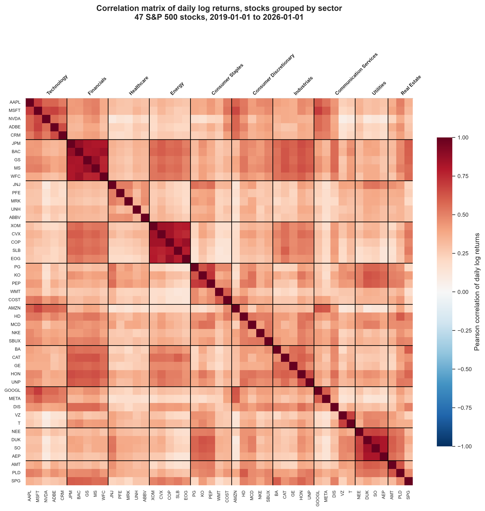
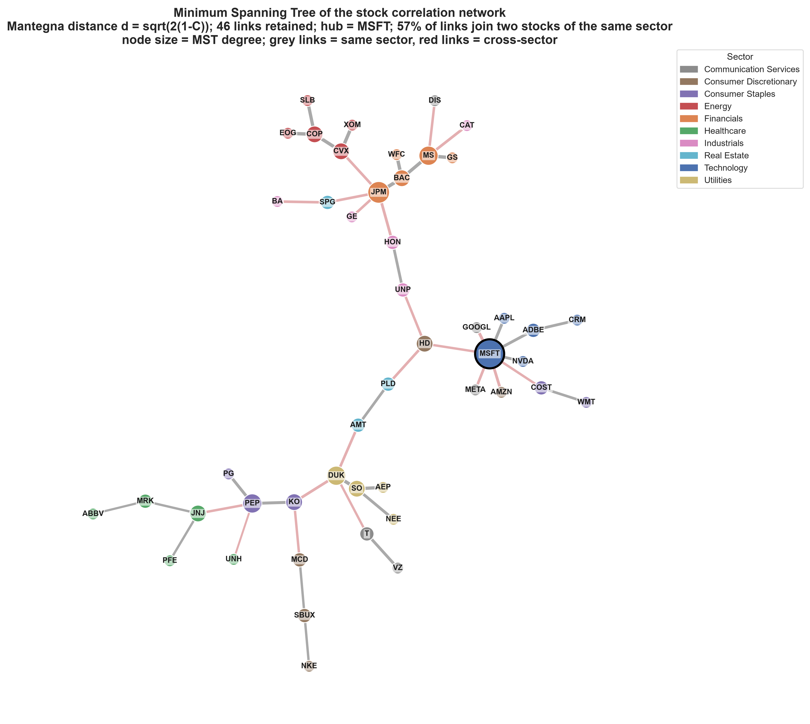

# Analysis of Stock Correlation Networks through Graph Traversal Algorithms

Bachelor thesis project exploring the structure of stock-market co-movements through **graph theory and network analysis**.

The project downloads historical equity prices, computes daily log returns and Pearson correlations, builds stock-correlation networks, and analyses their structure using **BFS, DFS, connected components, centrality measures and a Minimum Spanning Tree (MST)**.

> **Scope:** This is an exploratory and descriptive analysis of financial dependence structures. It does not predict returns and does not constitute investment advice.

---

## Key Features

- Analysis of **47 large-cap S&P 500 stocks across 10 GICS sectors**
- Historical price collection through **Yahoo Finance**
- Daily **log-return** calculation and Pearson correlation analysis
- Construction of weighted stock-correlation networks
- Threshold-based network analysis across multiple correlation levels
- **BFS and DFS implemented from scratch** and validated against NetworkX
- Connected-components, articulation-point and bridge analysis
- Degree, betweenness, closeness and eigenvector centrality
- Clustering and assortativity analysis
- **Minimum Spanning Tree** based on Mantegna distance
- Reproducible Python pipeline from data collection to final outputs

---

## Project Visuals

### Correlation Structure



The correlation matrix provides an overview of pairwise stock co-movements and helps reveal sector-level structure.

### Threshold Correlation Network


Stocks are represented as nodes, while an edge is retained when the absolute correlation between two stocks exceeds the selected threshold.

### Minimum Spanning Tree



The MST provides a sparse backbone of the market network by retaining the strongest relationships required to connect the full stock universe without cycles.

> To display these figures on GitHub, place the selected images in an `assets/` folder using the filenames above.

---

## Methodology

### 1. Data Collection

Adjusted closing prices are downloaded from Yahoo Finance for a balanced universe of 47 large-cap U.S. stocks across 10 sectors.

Adjusted prices are used instead of raw closing prices to reduce distortions caused by stock splits and dividend events.

### 2. Data Preprocessing

The pipeline:

- aligns trading calendars;
- handles missing observations;
- removes stocks with excessive missing data;
- computes daily log returns:

\[
r_t = \ln\left(\frac{P_t}{P_{t-1}}\right)
\]

### 3. Correlation Analysis

A Pearson correlation matrix is estimated from daily log returns.

For each stock pair, the project records:

- correlation;
- absolute correlation;
- sector membership;
- same-sector / cross-sector relationship.

The analysis also compares average within-sector and cross-sector correlations.

### 4. Network Construction

Stocks are represented as nodes and correlations as weighted edges.

Threshold graphs retain an edge when:

\[
|C_{ij}| \geq \tau
\]

The network is analysed across several threshold values to study how its structure changes as weaker relationships are removed.

### 5. Graph Traversal

Both **Breadth-First Search (BFS)** and **Depth-First Search (DFS)** are implemented from scratch.

The custom implementations are validated against NetworkX.

**BFS** is used to study:

- shortest topological distances;
- reachability;
- BFS layers and trees.

**DFS** is used to study:

- traversal structure;
- connected components;
- DFS forests.

Both algorithms have time complexity:

\[
O(|V| + |E|)
\]

### 6. Structural Analysis

For each network, the project computes metrics including:

- number of nodes and edges;
- density;
- average degree;
- clustering coefficient;
- transitivity;
- connected components;
- giant-component size;
- isolated nodes;
- assortativity;
- path length and diameter within the giant component.

At node level, the analysis includes:

- degree;
- strength;
- betweenness centrality;
- closeness centrality;
- eigenvector centrality;
- clustering coefficient.

Articulation points and bridges are also identified to detect structural bottlenecks.

### 7. Minimum Spanning Tree

The project converts correlations into Mantegna distances:

\[
d_{ij} = \sqrt{2(1-C_{ij})}
\]

and constructs a Minimum Spanning Tree using Kruskal's algorithm.

The MST is analysed through:

- node degree;
- leaves;
- betweenness;
- eccentricity;
- tree depth;
- diameter;
- total tree length;
- sector composition of retained links.

---

## Technologies

**Python** · **Pandas** · **NumPy** · **NetworkX** · **SciPy** · **yfinance** · **Matplotlib** · **Seaborn**

---

## Project Structure

```text
thesis-network-analysis/
├── main.py
├── config.py
├── requirements.txt
├── README.md
│
├── assets/
│   ├── correlation_heatmap.png
│   ├── threshold_network.png
│   └── minimum_spanning_tree.png
│
├── data/
│   ├── raw/
│   └── processed/
│
├── outputs/
│   ├── figures/
│   ├── tables/
│   └── logs/
│
└── src/
    ├── data_collection.py
    ├── preprocessing.py
    ├── correlation.py
    ├── graph_construction.py
    ├── metrics.py
    ├── traversal_analysis.py
    ├── mst_analysis.py
    ├── visualisation.py
    ├── interpretation.py
    ├── portfolio.py
    └── utils.py
```

---

## Installation

Requires **Python 3.9+**.

```bash
git clone <repository-url>
cd thesis-network-analysis

python -m venv .venv
```

Activate the environment:

```bash
# macOS / Linux
source .venv/bin/activate

# Windows
.venv\Scripts\activate
```

Install dependencies:

```bash
pip install -r requirements.txt
```

---

## Running the Project

### Real market data

```bash
python main.py --refresh
```

This downloads fresh Yahoo Finance data and generates the analysis outputs.

### Offline pipeline test

```bash
python main.py --synthetic
```

Synthetic mode exists only to verify that the pipeline runs without an internet connection. Synthetic outputs are kept separate and are **not used as thesis results**.

### Useful options

```bash
python main.py --no-figures
python main.py --start 2020-01-01 --end 2024-12-31
python main.py --main-threshold 0.6 --source MSFT
python main.py --thresholds 0.2 0.3 0.4 0.5 0.6 0.7 0.8
```

---

## Main Outputs

The pipeline generates:

- return summary statistics;
- correlation matrices;
- sector-level correlation summaries;
- network metrics across thresholds;
- node-level centrality measures;
- connected-component analysis;
- BFS and DFS outputs;
- articulation-point and bridge analysis;
- Minimum Spanning Tree metrics;
- network and correlation visualisations;
- summary interpretation reports.

---

## Key Interpretation

The project investigates how financial-market structure changes as weaker correlations are progressively removed.

Particular attention is given to:

- sectoral clustering;
- the fragmentation of the network across thresholds;
- central and peripheral stocks;
- connector nodes and structural bottlenecks;
- the sparse market backbone represented by the MST.

The analysis is descriptive: network position is interpreted as a property of the estimated correlation structure, not as a prediction of future investment performance.

---

## Limitations

- Pearson correlation captures only **linear dependence**.
- Correlations are estimated over a fixed sample period and may change across market regimes.
- Network structure depends on the selected correlation threshold.
- The stock universe is limited to 47 large-cap U.S. equities.
- Correlation does not imply causation.
- The framework does not forecast returns.

Potential extensions include rolling-window networks, partial correlations, community detection, richer filtering methods and predictive models using network features.

---

## Academic Context

This project was developed as the practical component of my Bachelor's thesis:

**“Analysis of Stock Correlation Networks through Graph Traversal Algorithms.”**

It combines concepts from **graph algorithms, network science, data analysis and finance** in a fully reproducible Python workflow.

---

## Disclaimer

This project is for academic and exploratory purposes only. It does not constitute investment advice and does not predict future returns.
